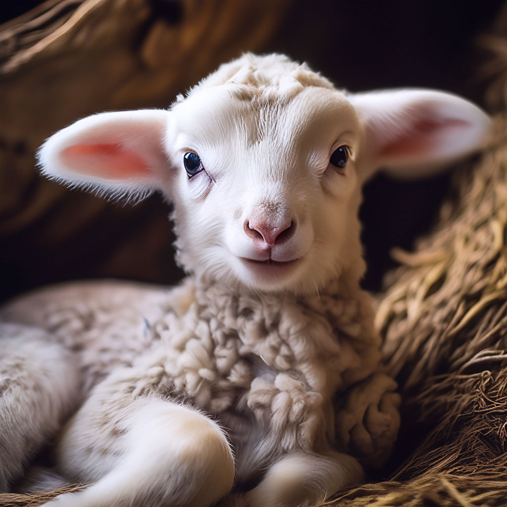

## Hello, world!
Амбициозный, свободолюбивый и нетерпеливый — огненный Овен покровительствует людям, рожденным в конце марта и первых двух декадах апреля. Управляющая планета инициативных и активных Овнов — Марс. Овен символизирует инициативность и любовь к жизни, а сила его характера способна двигать горы в стремлении достичь своей цели.
1. стихия — огонь;
2. планета — Марс;
3. цвет — оттенки красного, золотой;
4. талисманы — золотое руно, рог изобилия, жук-скарабей, молот;
5. камни — бриллиант, рубин, красные и золотистые самоцветы;
6. символ — баран и олень;
7. счастливое число — 4 (и кратные четырем), 7, 9;
8. счастливые дни недели — вторник и воскресенье;
9. дерево — орешник (I декада знака), рябина (II декада знака) и клен (III декада), магическую защиту всем Овнам дает дуб;
10. цветок — белые анемоны, адонисы (Овнам первой декады знака будет покровительствовать наперстянка, рожденным во второй декаде — магнолия, а в третьей — гортензия);
11. металл — сталь.

*Несмотря на свой детский эгоизм и чрезвычайную самоуверенность, из Овнов получаются отличные друзья. Если вы хотите узнать точное мнение по какому-либо вопросу, бегите за экспертным мнением в Овну. Он без доли лукавства и лжи даст развернутый ответ, сформулировав с присущей прямотой. Иногда «дети огня» могут на ровном месте раздуть из мухи слона, но они очень отходчивые и быстро забывают обиды.*

[def]: 1a09a4ac69a611ee841592669a1675b3_upscaled.jpg
